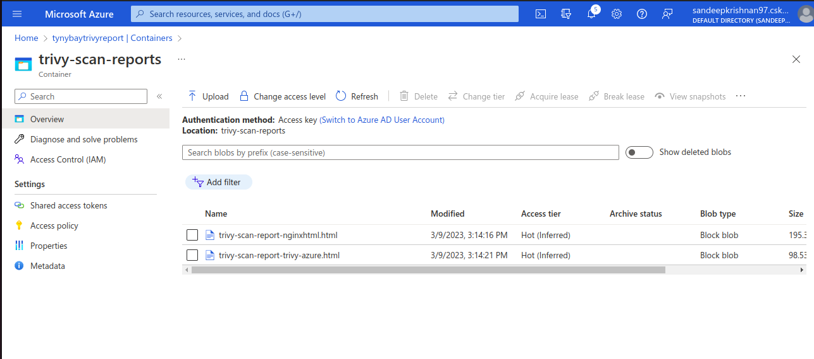

# Canvass-trivy
Trivy setup for image scanning used by tynybay also


## Table of Contents
- Prerequisites
- Usage

## Prerequisites
Make sure that the below items are in place:

1. You have an existing Azure Subscription, if not create one.
2. Install Azure CLI if not already installed using the below documentation.
    [Azure CLI](https://learn.microsoft.com/en-us/cli/azure/install-azure-cli)
3. Open your command prompt or terminal and login to your Azure account by running the following command:
```bash
az login
```
4. Create a resource group where all the resources will be grouped.
```bash
az group create --name <resource-group-name> --location <location>
```
5. Create an Azure Container Registry(ACR) by running the following command:
```bash
az acr create --resource-group <resource-group-name> --name <acr-name> --sku <acr-sku>
```
Replace <resource-group-name> with the name of your resource group, <acr-name> with the name you want to give your ACR, and <acr-sku> with the SKU (pricing tier) you want to use for your ACR. The available SKUs are Basic, Standard, and Premium.
6. Create an AKS cluster (preferably with v1.25.5) by running the following command:
```bash
az aks create --resource-group <resource-group-name> --name <cluster-name> --node-count <node-count> --kubernetes-version 1.25.5 --generate-ssh-keys
```
7. Once the AKS cluster is created, you can connect to it by running the following command:
```bash
az aks get-credentials --resource-group <resource-group-name> --name <cluster-name>
```
8. Create a new Azure Storage account by running the following command:
```bash
az storage account create --name <account-name> --resource-group <resource-group-name> --location <location> --sku Standard_LRS
```
9. Create a new container inside your storage account by running the following command:
```bash
az storage container create --account-name <account-name> --account-key <account-key> --name <container-name>
```
10. Make sure kubectl is installed on your terminal/cmd prompt using the below documentation
    [kubectl](https://kubernetes.io/docs/tasks/tools/)

## Usage
1. Clone the repository to your local machine
2. Navigate to the project directory
3. Apply the deployment and service manifest files onto the k8s cluster using the below command
```bash
kubectl apply -f trivy-server.yaml
kubectl apply -f trivy-service.yaml
```
4. Get the external/public ip of the load balancer service using the below command and paste it in the "LOAD_BALANCER_PUBLIC_IP" env variable inside k8s-cronjob.yaml file
```bash
kubectl get svc trivy-server-lb -o=jsonpath='{.status.loadBalancer.ingress[0].ip}'
```
5. Get your storage account name/key using the below command and paste the key in the "accountkey" inside azure-storage-secret.yaml
```bash
az storage account keys list --account-name <account-name> --resource-group <resourcegroupname>
```
6. Apply the storage secret file onto the k8s cluster using the below command
```bash
kubectl apply -f azure-storage-secret.yaml
```
7. Create a service principal in azure as stated below:
```bash
az ad sp create-for-rbac --name "trivy-scanner" --scopes "/subscriptions/<subscription_id>/resourceGroups/<resource_group_name>" --role "Contributor" --output json
```
8. Store the ClientId,TenantId & ClientSecret from the output of the previous command and paste them in the respective env variable inside the service-principal-secret.yaml file.

9. Apply the service principal secret file onto the k8s cluster using the below command
```bash
kubectl apply -f service-principal-secret.yaml
```

10. After adding all the necessary Id's and Key's inside the cronjob file, run the below command to apply it.
 ```bash
kubectl apply -f k8s-cronjob.yaml
```
11. Check the logs of the trivy-client pod after cronjob has started. Run the following commands-
```bash
kubectl get all
kubectl logs pod/trivy-client-********-*****
```
Note: The stars marked here represent the unique id of the trivy-client pod which can be fetched from the output of the first command.

12. You should be able to see the trivy scanned vulnerability reports inside the azure storage container if the setup is performed correctly.
